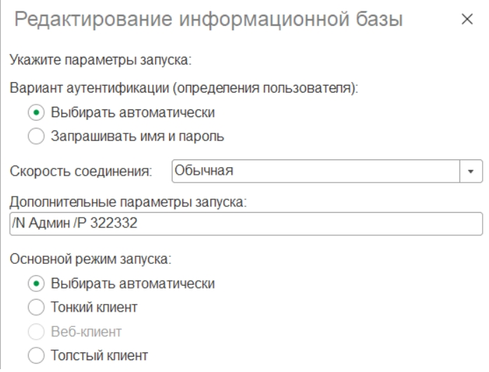

## 1C (ERP, Trade, Platform)

#### 1. Get a XSD-scheme from the Diadoc (Com component)

```text
ОписаниеВыполнения = "";
DiadocAPI = ПолучитьДиадокАпи(ОписаниеВыполнения);
Organization = ПолучитьОрганизацию(DiadocAPI, ОписаниеВыполнения);
	
ДвоичныеДанныеСхемы = Base64Значение(
    Organization.GetBase64UserDataXSD("UniversalCorrectionDocument", 
                                      "КСЧФДИС", 
                                      "ucd736_05_01_02", 
                                      "Seller"));
    
ДвоичныеДанныеСхемы.Записать("<Path>\Схема.xsd");
```

```text
Функция ПолучитьДиадокАпи(ОписаниеВыполнения = "")

	КлючРазработчика = ПолучитьЗначениеНастройкиБазы("КлючРазработчикаДиадок", "");
	
	Попытка
		
		//создаем корневой элемент COM-объекта
		ДиадокАпи = Новый ComОбъект("Diadoc.DiadocClient");
		
		//Задаем параметры подлючения к серверу
		ДиадокАпи.ApiClientId = КлючРазработчика;
		ДиадокАпи.ServerUrl   = "https://diadoc-api.kontur.ru:443";
		
		Возврат ДиадокАпи;
		
	Исключение
		
		ТекстОшибки = "Не удалось получить API Diadoc: " + ОписаниеОшибки();
		ОписаниеВыполнения = ОписаниеВыполнения + ТекстОшибки + Символы.ПС;   		
		Возврат Неопределено;
		
	КонецПопытки;	

КонецФункции // ПолучитьДиадокАпи()
```

```text
Функция ПолучитьОрганизацию(ДиадокАпи, ОписаниеВыполнения = "")

	Попытка
		
		ЛогинДиадок = ПолучитьЗначениеНастройкиБазы("ЛогинДиадок", "");
		ПарольДиадок = ПолучитьЗначениеНастройкиБазы("ПарольДиадок", "");
		ДиадокСоединение = ДиадокАпи.CreateConnectionByLogin(ЛогинДиадок, ПарольДиадок);
		
	Исключение
		
		ТекстОшибки = "Не удалось получить соединение " + ОписаниеОшибки();
		ОписаниеВыполнения = ОписаниеВыполнения + ТекстОшибки + Символы.ПС;
		
		Возврат Неопределено;	
		
	КонецПопытки;
		
	Если ДиадокСоединение = Неопределено Тогда
		ТекстОшибки = "Не удалось получить соединение ";
		ОписаниеВыполнения = ОписаниеВыполнения + ТекстОшибки + Символы.ПС;
		Возврат Неопределено;
	КонецЕсли;
	
	Organization = ДиадокСоединение.GetOrganizationById(ПолучитьИДОсновнойОрганизации());
	
	Если Organization = Неопределено Тогда 
		ТекстОшибки = "Не удалось получить организацию ";
		ОписаниеВыполнения = ОписаниеВыполнения + ТекстОшибки + Символы.ПС;
		Возврат Неопределено;
	КонецЕсли;
	
	Возврат Organization;

КонецФункции // ПолучитьОрганизацию()
```

#### 2. Настройка удаленного рабочего места для работы с офисной 1С

### 1. Заполняем список серверов офиса, с которыми будете работать.
Указываем IP сервера, и как будете к нему обращаться.
В файле C:\Windows\System32\drivers\etc\hosts добавить строки (в конце файла):

Пример:
```text
192.168.20.101 RFTEST1C00001
192.168.20.98 RFPR1C00001
192.168.20.12 SHAIRPOINT
192.168.20.14 RFPR1C0005
192.168.20.181 RFPR1C00002
```

### 2. Заполняем список серверов офиса, с которыми будете работать.
Установить платформу/ы 1С, которая используется в компании. 


### 3. Лицензии 1С
Чтобы локальная 1С видела лицензии компании необходимо прописать в файле 
C:\Program Files\1cv8\conf\nethasp.ini список серверов с лицензиями. 

[Пример файла nethasp.ini](oneS/nethasp.ini)

```text
NH_SERVER_ADDR = 192.168.20.98, 192.168.20.14, 192.168.20.101
```

### 4. Настройка списка баз 1С

Добавить в список базы 1С, также как и в офисе. Например,
Srvr="RFTEST1C00001.office.local";Ref="erp_productive";
Чтобы каждый раз не вводить пароль и логин для аутентификации, можно указать 
дополнительные параметры запуска для базы
/N ваш_логин /P ваш_пароль



Другие параметры командной строки запуска можно посмотреть [здесь](https://wiseadvice-it.ru/o-kompanii/blog/articles/parametry-komandnoi-stroki-v-1s-8-3/).

Например, если запустить с параметром /RunModeOrdinaryApplication, то база созданная для работы
только в управляемом режиме запустится в толстом клиенте и в ней можно будет открыть стандартные
обработки типа поиска и замены значений.

### 5. Для разработчиков

- Выгрузить в dt-файл свою базу для разработок.
- Создать новую файловую базу на домашнем компьютере и загрузить в нее выгруженный dt-файл.
- Подключить базу к хранилищу (путь как и в рабочей сети)  
- Лучше сделать отдельную учетку в хранилище для домашнего компьютера, например UserRemote.

### 6. Дополнительный софт

Также не забыть поставить себе на комп другой используемый в работе софт (лицензионный):
Office 365
Microsoft Teams
Zoom
Joxi (для скринов)
Notepad++ (для заметок)
FileZilla (работа с FTP)


### 7. После этого можно работать также, как и на офисном компьютере.

Можно заходить на сетевые ресурсы. Например:
\\RFPR1C00001.office.local\MyData
Удобно настроить на рабочем столе ярлык чтобы сразу попасть в сетевую папку.

Работать с внутренним порталом компании, например SharePoint по обычным ссылкам:
http://SharePoint/Pages/Default.aspx

Работать в 1С.
Программировать в 1С.

**Чтобы всё это заработало, надо сначала запустить VPN Forti на компьютере**
